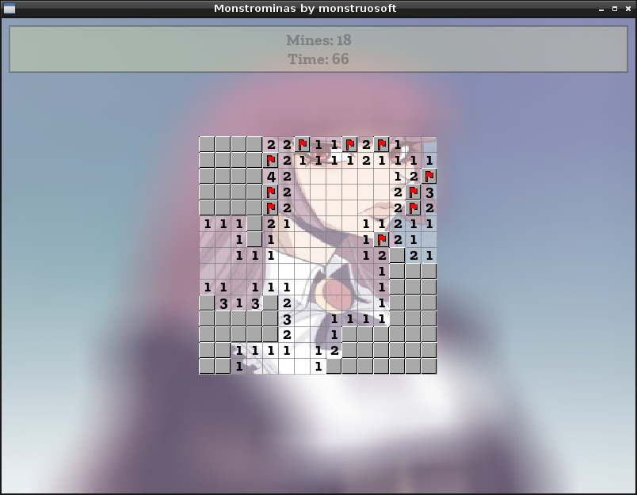

:octocat::octocat::octocat: To read the english version of this document [click here](./README.md). :octocat::octocat::octocat:

[](http://monstrochan.org/l/)
- - -
# monstrominas
#### *monstrominas* por *monstruosoft* por *monstrochan*

*monstrominas* es un clón de Buscaminas escrito para el Reto de la toja azul 2019 en [monstrochan.org](http://monstrochan.org/l/).



- - -
## Características
* Imagen de fondo.
* Tamaño interactivo (usa la rueda del mouse).

## Compilar
En **Linux**, el archivo `CMakeLists.txt` incluído debería ser suficiente para compilar el proyecto si se encuentran instaladas las librerías requeridas.

* Asegúrate de tener los siguientes paquetes instalados:
  * **CMake**
  * **Allegro 5** versión para desarrolladores
* Crea una carpeta con el nombre *build* dentro de la carpeta del proyecto y compila usando *CMake + make*:
```
monstruosoft@PC:~$ cd monstrominas
monstruosoft@PC:~/monstrominas$ mkdir build
monstruosoft@PC:~/monstrominas$ cd build
monstruosoft@PC:~/monstrominas/build$ cmake ..
monstruosoft@PC:~/monstrominas/build$ make
```

En **Windows** debería ser posible compilar el juego usando *CMake y MinGW* pero buena suerte con eso ya que yo no puedo probar a compilarlo en Windows.

## Ejecutar
El juego soporta imágenes de fondo en formato JPEG que se eligen al azar desde una carpeta que se pasa como argumento al programa:
```
monstruosoft@PC:~/monstrominas/build$ ./main ~/Pictures
```
Si no se pasa ninguna ruta como argumento al programa, el juego buscará de forma predeterminada en una carpeta llamada *data* en la misma carpeta que el ejecutable, de esta forma puedes usar la carpeta *data* para colocar ahí imágenes seleccionadas.
Si no se especifica ninguna ruta como argumento y tampoco existe la carpeta *data*, el juego correrá usando un fondo de color sólido.

