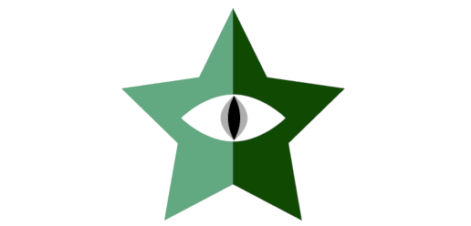
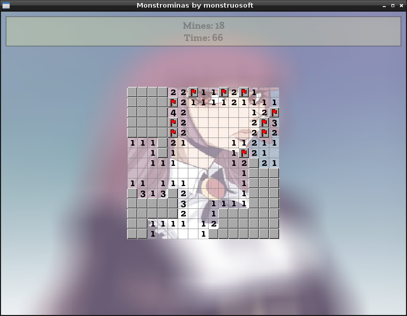

:octocat::octocat::octocat: Para leer la versión en español de este documento [haz click aquí](./LEEME.md). :octocat::octocat::octocat:

[](http://monstrochan.org/l/)
- - -
# monstrominas
#### *monstrominas* by *monstruosoft* by *monstrochan*

*monstrominas* is a Minesweeper clone written for the "Reto de la toja azul 2019" challenge at [monstrochan.org](http://monstrochan.org/l/).

 

- - -
## Features
* Background image (because, why not?).
* Interactive minefield size (use mouse wheel).

## Building
On **Linux**, the included `CMakeLists.txt` should build the project given that the necessary libraries are installed on your system.

* Make sure you have the required packages installed:
  * **CMake**
  * **Allegro 5** development files
* Create a *build* directory inside the project directory and build it using *CMake + make*:
```
monstruosoft@PC:~$ cd monstrominas
monstruosoft@PC:~/monstrominas$ mkdir build
monstruosoft@PC:~/monstrominas$ cd build
monstruosoft@PC:~/monstrominas/build$ cmake ..
monstruosoft@PC:~/monstrominas/build$ make
```

On **Windows**, you should be able to build the game using *CMake + MinGW*. Good luck with that, though, since I can't test the build process on Windows.
